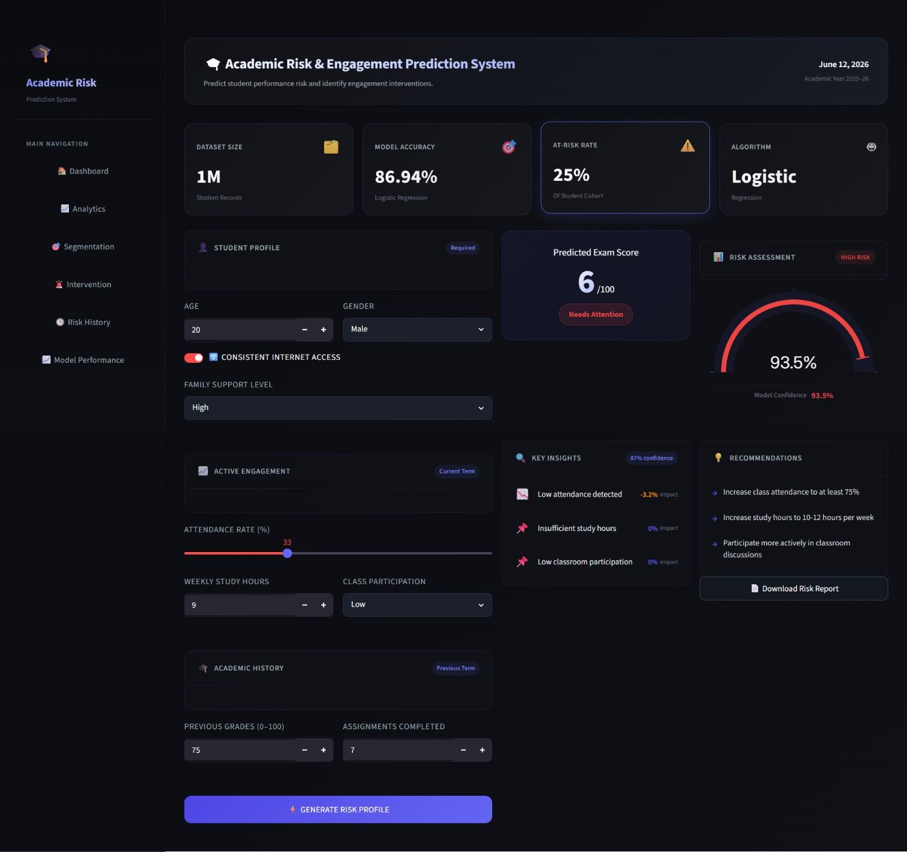
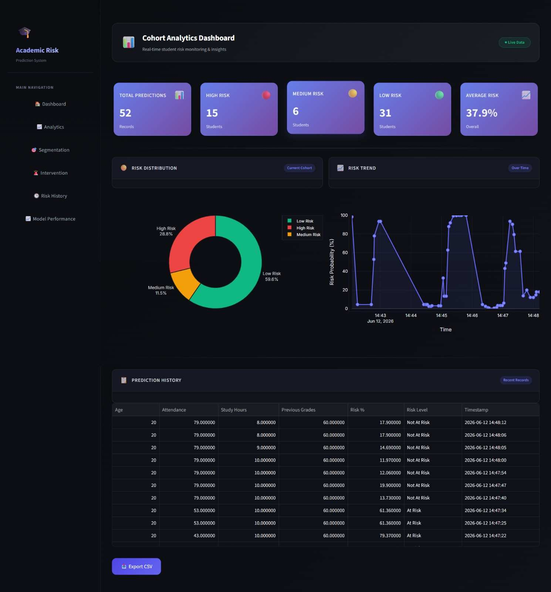
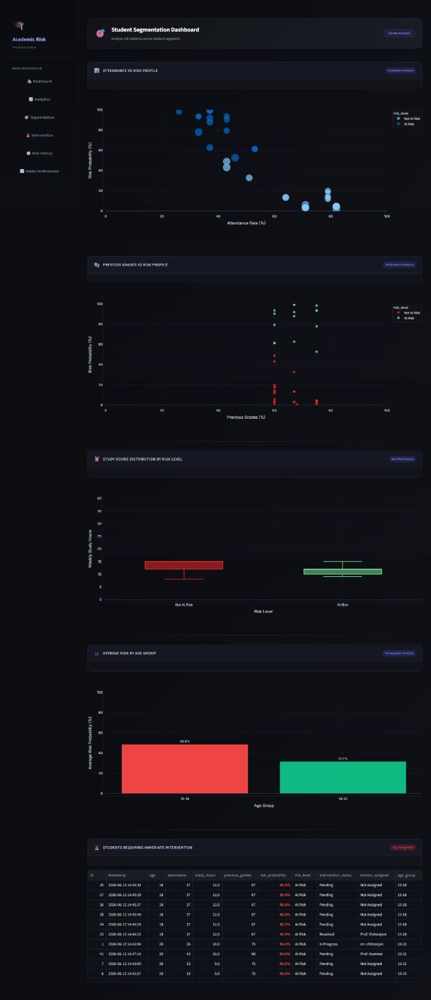
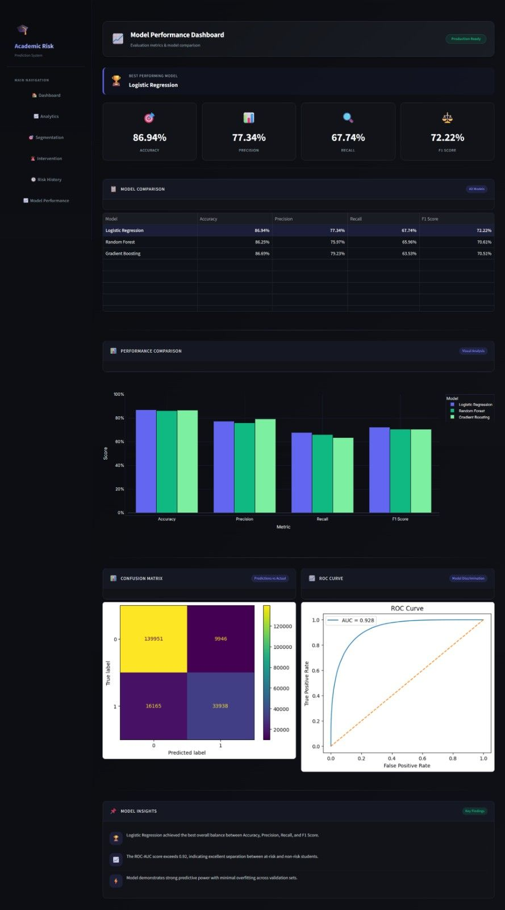
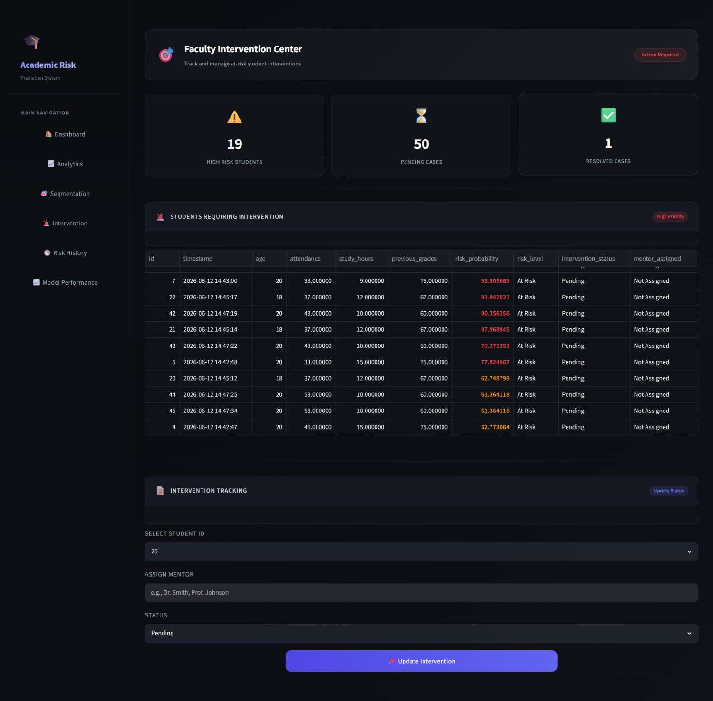
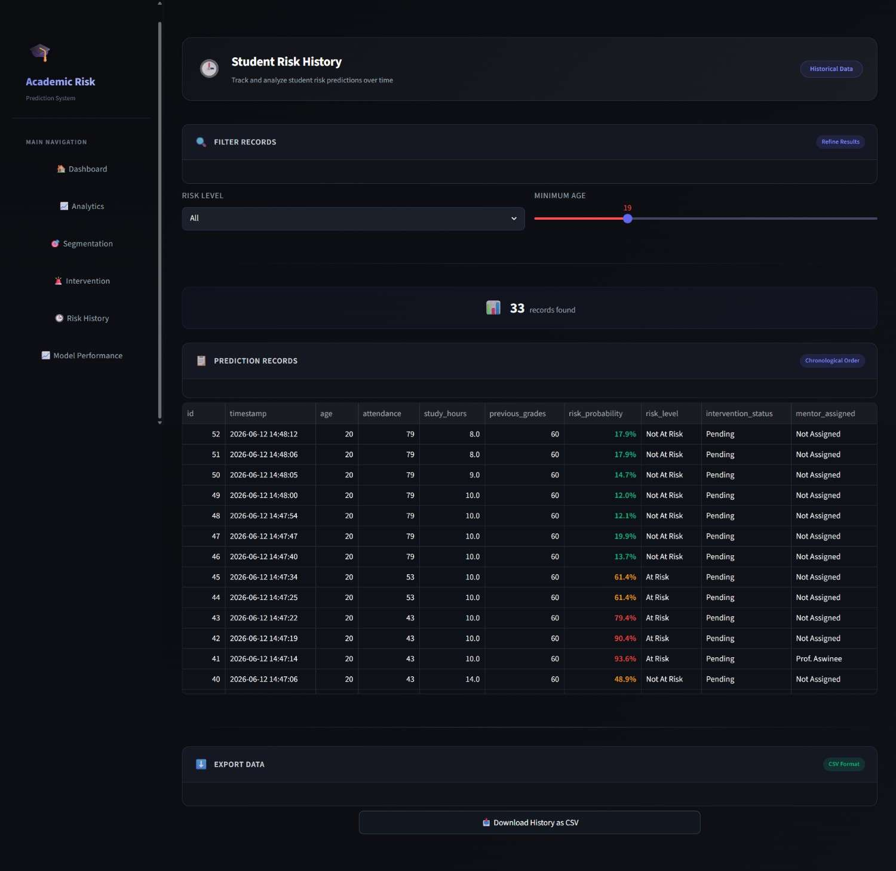
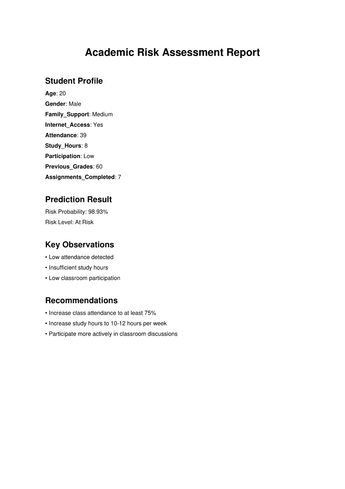

[](https://academic-risk-prediction.onrender.com)


# 🎓 Academic Risk Intelligence Platform

An end-to-end Machine Learning powered platform that identifies at-risk students, generates explainable insights, supports faculty interventions, and enables data-driven academic decision-making.

## 🌐 Live Demo

https://academic-risk-prediction.onrender.com

---

## 📌 Project Overview

Academic institutions often struggle to identify students who are at risk of poor academic performance until it is too late.

This platform leverages Machine Learning, Analytics, and Explainable AI to proactively predict academic risk and recommend intervention strategies.

The system combines:

* Student Risk Prediction
* Cohort Analytics
* Student Segmentation
* Faculty Intervention Dashboard
* Model Performance Monitoring
* Automated PDF Reporting

into a unified Academic Risk Intelligence Platform.

---

## 🚀 Key Features

### 🎯 Student Risk Prediction

Predict whether a student is academically at risk using:

* Attendance
* Study Hours
* Assignment Completion
* Previous Grades
* Participation
* Internet Access
* Family Support

### 📊 Cohort Analytics Dashboard

* Total Predictions
* High / Medium / Low Risk Counts
* Risk Distribution Analysis
* Historical Trends

### 👥 Student Segmentation

Categorize students into:

* High Risk
* Medium Risk
* Low Risk

for targeted interventions.

### 📈 Model Performance Dashboard

Monitor:

* Accuracy
* Precision
* Recall
* F1 Score
* ROC-AUC

with visual evaluation metrics.

### 🏫 Faculty Intervention Center

Identify students requiring immediate support and provide actionable recommendations.

### 📄 PDF Report Generation

Generate downloadable student risk reports automatically.

---

## 🏗️ System Architecture

```text
Student Data
      │
      ▼
Data Ingestion
      │
      ▼
Data Transformation
      │
      ▼
Feature Engineering
      │
      ▼
Machine Learning Model
(Logistic Regression)
      │
      ▼
Prediction Pipeline
      │
      ▼
Recommendation Engine
      │
      ▼
Analytics Dashboard
      │
      ▼
PDF Report Generation
```

---

## 🤖 Machine Learning Pipeline

### Data Ingestion

* Dataset Loading
* Train/Test Split

### Data Transformation

* Feature Encoding
* Data Preprocessing
* Pipeline Creation

### Models Evaluated

* Logistic Regression
* Random Forest
* Gradient Boosting

### Best Performing Model

**Logistic Regression**

---

## 📊 Model Performance

| Metric    | Score  |
| --------- | ------ |
| Accuracy  | 86.94% |
| Precision | 77.34% |
| Recall    | 67.74% |
| F1 Score  | 72.22% |
| ROC-AUC   | 92.84% |

---

## 🛠️ Tech Stack

### Frontend

* Streamlit

### Backend

* Python

### Machine Learning

* Scikit-Learn
* XGBoost

### Data Processing

* Pandas
* NumPy

### Visualization

* Plotly
* Matplotlib
* Seaborn

### Reporting

* ReportLab

### Database

* SQLite

### Deployment

* Render

---

# 📸 Application Screenshots

## 🎯 Main Prediction Dashboard



---

## 📊 Cohort Analytics Dashboard



---

## 👥 Student Segmentation



---

## 📈 Model Performance Dashboard



---

## 🏫 Faculty Intervention Dashboard



---

## 📋 Student Risk History



---

## 📄 PDF Risk Report



---

## 📂 Project Structure

```text
academic-risk-prediction/
│
├── app.py
├── pages/
├── src/
│   ├── components/
│   ├── pipelines/
│   ├── database/
│   ├── config/
│   ├── ui/
│   └── utils/
│
├── artifacts/
├── data/
├── notebooks/
├── screenshots/
├── requirements.txt
├── render.yaml
└── README.md
```

---

## ⚙️ Installation

### Clone Repository

```bash
git clone https://github.com/chitranjan-nirala/academic-risk-prediction.git
```

### Move into Project

```bash
cd academic-risk-prediction
```

### Create Virtual Environment

```bash
python -m venv .venv
```

### Activate Environment

```bash
.venv\Scripts\activate
```

### Install Dependencies

```bash
pip install -r requirements.txt
```

### Run Application

```bash
streamlit run app.py
```

---

## 🎯 Future Enhancements

* PostgreSQL Integration
* User Authentication
* Faculty Login Portal
* Role-Based Access Control
* Real-Time Monitoring
* Automated Retraining Pipeline
* Cloud Storage Integration

---

## 👨‍💻 Author

### Chitranjan Kumar

UI/UX Designer | Data Analytics Enthusiast | Machine Learning Practitioner

🔗 GitHub: https://github.com/chitranjan-nirala

🌐 Live Demo: https://academic-risk-prediction.onrender.com

---

## ⭐ Support

If you found this project useful, please consider giving it a ⭐ on GitHub.
